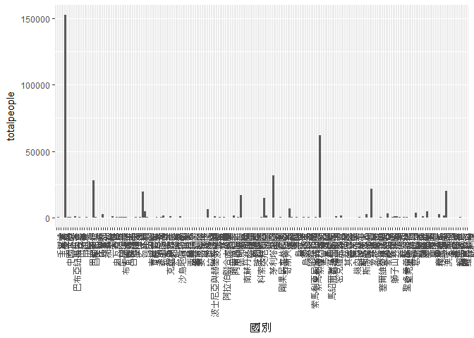
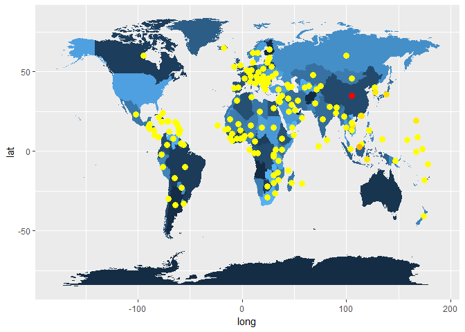
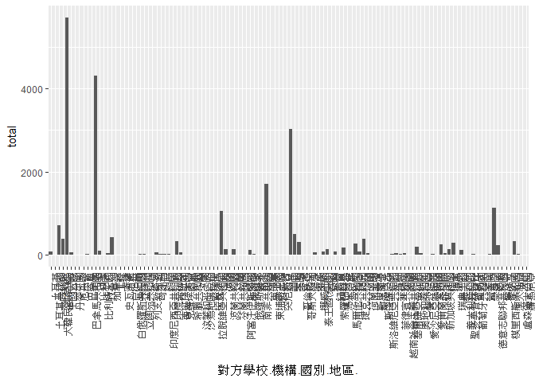
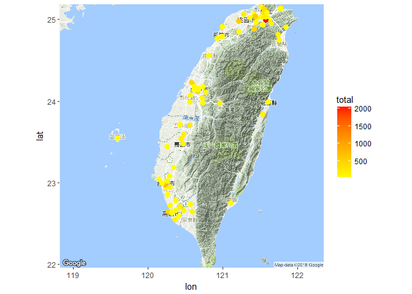
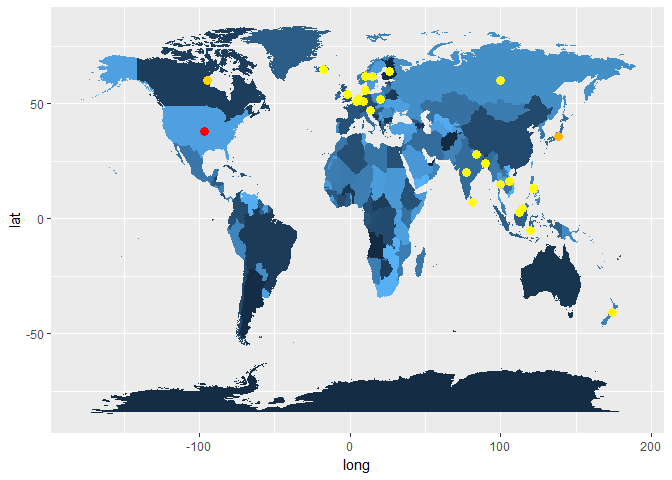

106-2 大數據分析方法 作業二
================
Yi-Ju Tseng

作業完整說明[連結](https://docs.google.com/document/d/1aLGSsGXhgOVgwzSg9JdaNz2qGPQJSoupDAQownkGf_I/edit?usp=sharing)

學習再也不限定在自己出生的國家，台灣每年有許多學生選擇就讀國外的大專院校，同時也有人多國外的學生來台灣就讀，透過分析[大專校院境外學生人數統計](https://data.gov.tw/dataset/6289)、[大專校院本國學生出國進修交流數](https://data.gov.tw/dataset/24730)、[世界各主要國家之我國留學生人數統計表](https://ws.moe.edu.tw/Download.ashx?u=C099358C81D4876CC7586B178A6BD6D5062C39FB76BDE7EC7685C1A3C0846BCDD2B4F4C2FE907C3E7E96F97D24487065577A728C59D4D9A4ECDFF432EA5A114C8B01E4AFECC637696DE4DAECA03BB417&n=4E402A02CE6F0B6C1B3C7E89FDA1FAD0B5DDFA6F3DA74E2DA06AE927F09433CFBC07A1910C169A1845D8EB78BD7D60D7414F74617F2A6B71DC86D17C9DA3781394EF5794EEA7363C&icon=..csv)可以了解103年以後各大專院校國際交流的情形。請同學分析以下議題，並以視覺化的方式呈現分析結果，呈現103年以後大專院校國際交流的情形。

來台境外生分析
--------------

### 資料匯入與處理

``` r
#這是R Code Chunk
library(readr)
library(dplyr)
```

    ## 
    ## Attaching package: 'dplyr'

    ## The following objects are masked from 'package:stats':
    ## 
    ##     filter, lag

    ## The following objects are masked from 'package:base':
    ## 
    ##     intersect, setdiff, setequal, union

``` r
library(ggplot2)
library(choroplethr)
```

    ## Loading required package: acs

    ## Loading required package: stringr

    ## Loading required package: XML

    ## 
    ## Attaching package: 'acs'

    ## The following object is masked from 'package:dplyr':
    ## 
    ##     combine

    ## The following object is masked from 'package:base':
    ## 
    ##     apply

``` r
library(rgdal)
```

    ## Loading required package: sp

    ## rgdal: version: 1.2-20, (SVN revision 725)
    ##  Geospatial Data Abstraction Library extensions to R successfully loaded
    ##  Loaded GDAL runtime: GDAL 2.2.3, released 2017/11/20
    ##  Path to GDAL shared files: C:/Users/USER/Documents/R/win-library/3.5/sf/gdal
    ##  GDAL binary built with GEOS: TRUE 
    ##  Loaded PROJ.4 runtime: Rel. 4.9.3, 15 August 2016, [PJ_VERSION: 493]
    ##  Path to PROJ.4 shared files: C:/Users/USER/Documents/R/win-library/3.5/sf/proj
    ##  Linking to sp version: 1.2-7

``` r
library(maptools)
```

    ## Checking rgeos availability: FALSE
    ##      Note: when rgeos is not available, polygon geometry     computations in maptools depend on gpclib,
    ##      which has a restricted licence. It is disabled by default;
    ##      to enable gpclib, type gpclibPermit()

``` r
library(jsonlite)


X103_ab103_C <- read_csv("C:/Users/USER/Downloads/103_ab103_C.csv")
```

    ## Parsed with column specification:
    ## cols(
    ##   洲別 = col_character(),
    ##   國別 = col_character(),
    ##   `學位生-正式修讀學位外國生` = col_integer(),
    ##   `學位生-僑生(含港澳)` = col_integer(),
    ##   `學位生-正式修讀學位陸生` = col_integer(),
    ##   `非學位生-外國交換生` = col_integer(),
    ##   `非學位生-外國短期研習及個人選讀` = col_integer(),
    ##   `非學位生-大專附設華語文中心學生` = col_integer(),
    ##   `非學位生-大陸研修生` = col_integer(),
    ##   `非學位生-海青班` = col_integer(),
    ##   境外專班 = col_integer()
    ## )

``` r
X104_ab104_C <- read_csv("C:/Users/USER/Downloads/104_ab104_C.csv")
```

    ## Parsed with column specification:
    ## cols(
    ##   洲別 = col_character(),
    ##   國別 = col_character(),
    ##   `學位生-正式修讀學位外國生` = col_integer(),
    ##   `學位生-僑生(含港澳)` = col_integer(),
    ##   `學位生-正式修讀學位陸生` = col_integer(),
    ##   `非學位生-外國交換生` = col_integer(),
    ##   `非學位生-外國短期研習及個人選讀` = col_integer(),
    ##   `非學位生-大專附設華語文中心學生` = col_integer(),
    ##   `非學位生-大陸研修生` = col_integer(),
    ##   `非學位生-海青班` = col_integer(),
    ##   境外專班 = col_integer()
    ## )

``` r
X105_ab105_C <- read_csv("C:/Users/USER/Downloads/105_ab105_C.csv")
```

    ## Parsed with column specification:
    ## cols(
    ##   洲別 = col_character(),
    ##   國別 = col_character(),
    ##   學位生_正式修讀學位外國生 = col_integer(),
    ##   `學位生_僑生(含港澳)` = col_integer(),
    ##   學位生_正式修讀學位陸生 = col_integer(),
    ##   非學位生_外國交換生 = col_integer(),
    ##   非學位生_外國短期研習及個人選讀 = col_integer(),
    ##   非學位生_大專附設華語文中心學生 = col_integer(),
    ##   非學位生_大陸研修生 = col_integer(),
    ##   非學位生_海青班 = col_integer(),
    ##   境外專班 = col_integer()
    ## )

``` r
X106_ab105_C <- read_csv("C:/Users/USER/Downloads/106_ab105_C.csv")
```

    ## Parsed with column specification:
    ## cols(
    ##   洲別 = col_character(),
    ##   國別 = col_character(),
    ##   學位生_正式修讀學位外國生 = col_integer(),
    ##   `學位生_僑生(含港澳)` = col_integer(),
    ##   學位生_正式修讀學位陸生 = col_integer(),
    ##   非學位生_外國交換生 = col_integer(),
    ##   非學位生_外國短期研習及個人選讀 = col_integer(),
    ##   非學位生_大專附設華語文中心學生 = col_integer(),
    ##   非學位生_大陸研修生 = col_integer(),
    ##   非學位生_海青班 = col_integer(),
    ##   境外專班 = col_integer()
    ## )

``` r
names(X103_ab103_C)[3:10] <-gsub("-","_",names(X103_ab103_C)[3:10])
names(X104_ab104_C)[3:10] <-gsub("-","_",names(X104_ab104_C)[3:10])
newdata1 <- rbind(X103_ab103_C,X104_ab104_C,X105_ab105_C,X106_ab105_C)


school103 <- read_csv("C:/Users/USER/Downloads/103_ab103_S.csv")
```

    ## Parsed with column specification:
    ## cols(
    ##   學校類型 = col_character(),
    ##   學校代碼 = col_character(),
    ##   學校名稱 = col_character(),
    ##   `學位生-正式修讀學位外國生` = col_integer(),
    ##   `學位生-僑生(含港澳)` = col_integer(),
    ##   `學位生-正式修讀學位陸生` = col_integer(),
    ##   `非學位生-外國交換生` = col_integer(),
    ##   `非學位生-外國短期研習及個人選讀` = col_integer(),
    ##   `非學位生-大專附設華語文中心學生` = col_integer(),
    ##   `非學位生-大陸研修生` = col_character(),
    ##   `非學位生-海青班` = col_integer(),
    ##   境外專班 = col_integer()
    ## )

``` r
school104 <- read_csv("C:/Users/USER/Downloads/104_ab104_S.csv")
```

    ## Parsed with column specification:
    ## cols(
    ##   學校類型 = col_character(),
    ##   學校代碼 = col_character(),
    ##   學校名稱 = col_character(),
    ##   `學位生-正式修讀學位外國生` = col_integer(),
    ##   `學位生-僑生(含港澳)` = col_integer(),
    ##   `學位生-正式修讀學位陸生` = col_integer(),
    ##   `非學位生-外國交換生` = col_integer(),
    ##   `非學位生-外國短期研習及個人選讀` = col_integer(),
    ##   `非學位生-大專附設華語文中心學生` = col_integer(),
    ##   `非學位生-大陸研修生` = col_character(),
    ##   `非學位生-海青班` = col_integer(),
    ##   境外專班 = col_integer()
    ## )

``` r
school105 <- read_csv("C:/Users/USER/Downloads/105_ab105_S.csv")
```

    ## Parsed with column specification:
    ## cols(
    ##   學校類型 = col_character(),
    ##   學校代碼 = col_character(),
    ##   學校名稱 = col_character(),
    ##   學位生_正式修讀學位外國生 = col_integer(),
    ##   `學位生_僑生(含港澳)` = col_integer(),
    ##   學位生_正式修讀學位陸生 = col_integer(),
    ##   非學位生_外國交換生 = col_integer(),
    ##   非學位生_外國短期研習及個人選讀 = col_integer(),
    ##   非學位生_大專附設華語文中心學生 = col_integer(),
    ##   非學位生_大陸研修生 = col_integer(),
    ##   非學位生_海青班 = col_integer(),
    ##   境外專班 = col_integer()
    ## )

``` r
school106 <- read_csv("C:/Users/USER/Downloads/106_ab105_S.csv")
```

    ## Parsed with column specification:
    ## cols(
    ##   學校類型 = col_character(),
    ##   學校代碼 = col_character(),
    ##   學校名稱 = col_character(),
    ##   學位生_正式修讀學位外國生 = col_integer(),
    ##   `學位生_僑生(含港澳)` = col_integer(),
    ##   學位生_正式修讀學位陸生 = col_integer(),
    ##   非學位生_外國交換生 = col_integer(),
    ##   非學位生_外國短期研習及個人選讀 = col_integer(),
    ##   非學位生_大專附設華語文中心學生 = col_integer(),
    ##   非學位生_大陸研修生 = col_integer(),
    ##   非學位生_海青班 = col_integer(),
    ##   境外專班 = col_integer()
    ## )

``` r
names(school103)[4:11] <-gsub("-","_",names(school103)[4:11])
names(school104)[4:11] <-gsub("-","_",names(school104)[4:11])

school104 <- school104[-151,] 
school105 <- school105[-151,] 
school106 <- school106[-151,] 
newschool <- rbind(school103,school104,school105,school106)


newschool$非學位生_大陸研修生 <- gsub("…","0",newschool$非學位生_大陸研修生)
newschool$非學位生_大陸研修生 <- as.numeric(newschool$非學位生_大陸研修生)
```

### 哪些國家來台灣唸書的學生最多呢？

``` r
#這是R Code Chunk
newdata1$學生總數<- rowSums(newdata1[3:11])
newschool$學生總數 <- rowSums(newschool[4:12])

ans1 <- group_by(newdata1,國別)%>%
summarise(totalpeople = sum(學生總數))%>%
arrange(desc(totalpeople))

knitr::kable(head(ans1,10))
```

| 國別     |  totalpeople|
|:---------|------------:|
| 中國大陸 |       152524|
| 馬來西亞 |        62031|
| 香港     |        31940|
| 日本     |        28200|
| 越南     |        21670|
| 澳門     |        20302|
| 印尼     |        19620|
| 南韓     |        16948|
| 美國     |        14846|
| 泰國     |         7035|

``` r
ans2  <- group_by(newschool,學校名稱)%>%
summarise(total = sum(學生總數))%>%
arrange(desc(total))
knitr::kable(head(ans2,10))
```

| 學校名稱         |  total|
|:-----------------|------:|
| 國立臺灣師範大學 |  22113|
| 國立臺灣大學     |  18199|
| 中國文化大學     |  16074|
| 銘傳大學         |  16057|
| 淡江大學         |  13887|
| 國立政治大學     |  11626|
| 國立成功大學     |  10982|
| 輔仁大學         |   9499|
| 逢甲大學         |   9474|
| 中原大學         |   7662|

### 哪間大學的境外生最多呢？

``` r
#這是R Code Chunk
ans2[1,]
```

    ## # A tibble: 1 x 2
    ##   學校名稱         total
    ##   <chr>            <dbl>
    ## 1 國立臺灣師範大學 22113

### 各個國家來台灣唸書的學生人數條狀圖

``` r
#這是R Code Chunk
ggplot()+geom_bar(data = ans1,
                  aes(x = 國別,y = totalpeople),
                  stat = 'identity')+
                  theme(axis.text.x = element_text(angle = 90, hjust = 1))
```



### 各個國家來台灣唸書的學生人數面量圖

``` r
#這是R Code Chunk
library(rworldmap)
```

    ## ### Welcome to rworldmap ###

    ## For a short introduction type :   vignette('rworldmap')

``` r
countries <- fromJSON("C:/Users/USER/Downloads/countries.json")  

ans11 <- group_by(newdata1,國別)%>%
  summarise(totalpeople = sum(學生總數))

for(i in 1:nrow(ans11)){
  for(j in 1:nrow(countries)){
    if(ans11$國別[i]==countries$Taiwan[j]){
      ans11$國別[i] <- countries$ISO2[j]
    }
    else if(substr(ans11$國別[i],1,2)==substr(countries$Taiwan[j],1,2)){
      ans11$國別[i] <- countries$ISO2[j]
    }
  }
}

ans11$國別[50] <- "HK"
ans11$國別[67] <- "BA"
ans11$國別[72] <- "RO"
ans11$國別[80] <- "KR"
ans11$國別[87] <- "VG"
ans11$國別[108] <- "MX"
ans11$國別[112] <- "RS"
ans11$國別[167] <- "AW"
ans11$國別[173] <- "CV"

Country_Latitude_Longitude <- read_csv("C:/Users/USER/Downloads/Country_List_ISO_3166_Codes_Latitude_Longitude.csv")
```

    ## Parsed with column specification:
    ## cols(
    ##   Country = col_character(),
    ##   `Alpha-2 code` = col_character(),
    ##   `Alpha-3 code` = col_character(),
    ##   `Numeric code` = col_integer(),
    ##   `Latitude (average)` = col_double(),
    ##   `Longitude (average)` = col_double(),
    ##   Icon = col_character()
    ## )

``` r
library(rworldmap)
library(ggplot2)


names(ans11)<-c("Alpha-2 code","total")
world_lat_long <- left_join(ans11,Country_Latitude_Longitude, by = "Alpha-2 code")

world_lat_long$`Longitude (average)` <- as.numeric(world_lat_long$`Longitude (average)`)
world_lat_long$`Latitude (average)`<- as.numeric(world_lat_long$`Latitude (average)`)


map.world <- map_data(map="world")

ggplot()+ 
  theme(legend.position="none")+
  geom_map(data=map.world, map=map.world, aes(map_id=region, x=long, y=lat,fill=group))+ 
  geom_point(data=world_lat_long,
             aes(x=`Longitude (average)`, y=`Latitude (average)`,color=total),size=3)+
  scale_color_continuous(low = "yellow",high = "red")+ 
  guides(size=FALSE)
```

    ## Warning: Ignoring unknown aesthetics: x, y

    ## Warning: Removed 2 rows containing missing values (geom_point).



台灣學生國際交流分析
--------------------

### 資料匯入與處理

``` r
#這是R Code Chunk
A <- read.csv("C:/Users/USER/Downloads/A.csv")
stubd <- A[10799:nrow(A),]
```

### 台灣大專院校的學生最喜歡去哪些國家進修交流呢？

``` r
#這是R Code Chunk
ans3  <- group_by(stubd,對方學校.機構.國別.地區.)%>%
  summarise(total = n())%>%
  arrange(desc(total))
```

### 哪間大學的出國交流學生數最多呢？

``` r
#這是R Code Chunk
ans4  <- group_by(stubd,學校名稱)%>%
  summarise(total = n())%>%
  arrange(desc(total))
```

### 台灣大專院校的學生最喜歡去哪些國家進修交流條狀圖

``` r
#這是R Code Chunk
ggplot()+geom_bar(data = ans3,
                  aes(x = 對方學校.機構.國別.地區.,y = total),
                  stat = 'identity')+
  theme(axis.text.x = element_text(angle = 90, hjust = 1))
```



### 台灣大專院校的學生最喜歡去哪些國家進修交流面量圖

``` r
#這是R Code Chunk
u1_new <- read_csv("C:/Users/USER/Downloads/u1_new.csv")
```

    ## Parsed with column specification:
    ## cols(
    ##   代碼 = col_character(),
    ##   學校名稱 = col_character(),
    ##   縣市名稱 = col_character(),
    ##   地址 = col_character(),
    ##   電話 = col_character(),
    ##   網址 = col_character(),
    ##   體系別 = col_character()
    ## )

``` r
library(XML)
URL <- "http://download.post.gov.tw/post/download/1050812_%E8%A1%8C%E6%94%BF%E5%8D%80%E7%B6%93%E7%B7%AF%E5%BA%A6%28toPost%29.xml"
CT <- xmlParse(URL)
CT1 <- xmlToDataFrame(CT)

names(CT1)[1] <- "地址"
names(CT1)[2] <- "郵遞區號"
names(CT1)[3] <- "longitude"
names(CT1)[4] <- "latitude"

CT1$longitude <- as.numeric(as.character(CT1$longitude))
CT1$latitude <- as.numeric(as.character(CT1$latitude))

u1_new$地址 <- substr(u1_new$地址,6,11)
u1_new$地址[2] <- substr(u1_new$地址[2],1,5)
u1_new$地址[5] <- substr(u1_new$地址[5],1,5)
u1_new$地址[6] <- substr(u1_new$地址[6],1,5)
u1_new$地址[7] <- substr(u1_new$地址[7],1,5)
u1_new$地址[16] <- substr(u1_new$地址[16],1,5)
u1_new$地址[36] <- substr(u1_new$地址[36],1,5)
u1_new$地址[37] <- substr(u1_new$地址[37],1,5)
u1_new$地址[44] <- substr(u1_new$地址[44],1,5)
u1_new$地址[45] <- substr(u1_new$地址[45],1,5)
u1_new$地址[76] <- substr(u1_new$地址[76],1,5)
u1_new$地址[82] <- substr(u1_new$地址[82],1,5)
u1_new$地址[140] <- substr(u1_new$地址[140],1,5)
u1_new$地址[157] <- substr(u1_new$地址[157],1,5)

u1_new <- u1_new[,c(-5,-6,-7)]

result <- merge(CT1,u1_new,by = "地址")
result <- merge(result,ans4,by = "學校名稱")

library(ggmap)
twmap <- get_googlemap(center = c(lon=120.58,lat=23.58), 
                       zoom = 8,
                       language = "zh-TW")
```

    ## Map from URL : http://maps.googleapis.com/maps/api/staticmap?center=23.58,120.58&zoom=8&size=640x640&scale=2&maptype=terrain&language=zh-TW&sensor=false

``` r
ggmap(twmap)+geom_point(data = result,
                        aes(x=longitude,y=latitude,color = total),size=3)+
  scale_color_continuous(low = "yellow",high = "red")+ 
  guides(size=FALSE)
```

    ## Warning: Removed 4 rows containing missing values (geom_point).



台灣學生出國留學分析
--------------------

### 資料匯入與處理

``` r
#這是R Code Chunk
stuTW <- read_csv("C:/Users/USER/Downloads/105TW.csv")
```

    ## Warning: Missing column names filled in: 'X4' [4], 'X5' [5], 'X6' [6]

    ## Parsed with column specification:
    ## cols(
    ##   洲別 = col_character(),
    ##   國別 = col_character(),
    ##   總人數 = col_number(),
    ##   X4 = col_character(),
    ##   X5 = col_character(),
    ##   X6 = col_character()
    ## )

### 台灣學生最喜歡去哪些國家留學呢？

``` r
#這是R Code Chunk
knitr::kable(head(stuTW[order(stuTW$總人數,decreasing = TRUE),],10))
```

| 洲別   | 國別     | 總人數 | X4  | X5  | X6  |
|:-------|:---------|:------:|:----|:----|:----|
| 美洲   | 美國     |  21127 | NA  | NA  | NA  |
| 大洋洲 | 澳大利亞 |  13582 | NA  | NA  | NA  |
| 亞洲   | 日本     |  8444  | NA  | NA  | NA  |
| 美洲   | 加拿大   |  4827  | NA  | NA  | NA  |
| 歐洲   | 英國     |  3815  | NA  | NA  | NA  |
| 歐洲   | 德國     |  1488  | NA  | NA  | NA  |
| 大洋洲 | 紐西蘭   |  1106  | NA  | NA  | NA  |
| 歐洲   | 波蘭     |   561  | NA  | NA  | NA  |
| 亞洲   | 馬來西亞 |   502  | NA  | NA  | NA  |
| 歐洲   | 奧地利   |   419  | NA  | NA  | NA  |

### 台灣學生最喜歡去哪些國家留學面量圖

``` r
#這是R Code Chunk
countries <- fromJSON("C:/Users/USER/Downloads/countries.json")  

for(i in 1:nrow(stuTW)){
  for(j in 1:nrow(countries)){
    if(stuTW$國別[i]==countries$Taiwan[j]){
      stuTW$英文[i] <- countries$ISO2[j]
    }
  }
}
```

    ## Warning: Unknown or uninitialised column: '英文'.

``` r
stuTW<-stuTW[,c(1,3,7)]
names(stuTW)<-c("州别","總人數","Alpha-2 code")

Country_Latitude_Longitude <- read_csv("C:/Users/USER/Downloads/Country_List_ISO_3166_Codes_Latitude_Longitude.csv")
```

    ## Parsed with column specification:
    ## cols(
    ##   Country = col_character(),
    ##   `Alpha-2 code` = col_character(),
    ##   `Alpha-3 code` = col_character(),
    ##   `Numeric code` = col_integer(),
    ##   `Latitude (average)` = col_double(),
    ##   `Longitude (average)` = col_double(),
    ##   Icon = col_character()
    ## )

``` r
library(rworldmap)
library(ggplot2)

Map_stuTW <- left_join(stuTW,Country_Latitude_Longitude, by = "Alpha-2 code")

Map_stuTW$`Longitude (average)` <- as.numeric(Map_stuTW$`Longitude (average)`)
Map_stuTW$`Latitude (average)`<- as.numeric(Map_stuTW$`Latitude (average)`)

map.world <- map_data(map="world")

ggplot()+ 
  theme(legend.position="none")+
  geom_map(data=map.world, map=map.world, aes(map_id=region, x=long, y=lat,fill=group))+ 
  geom_point(data=Map_stuTW,
             aes(x=`Longitude (average)`, y=`Latitude (average)`,color=總人數),size=3)+
  scale_color_continuous(low = "yellow",high = "red")+ 
  guides(size=FALSE)
```

    ## Warning: Ignoring unknown aesthetics: x, y



綜合分析
--------

請問來台讀書與離台讀書的來源國與留學國趨勢是否相同(5分)？想來台灣唸書的境外生，他們的母國也有很多台籍生嗎？請圖文並茂說明你的觀察(10分)。

來台灣的和台灣出去留學的基本上沒有很大的相同性，通常台灣學生普遍往北歐，美國等地區留學，而來台灣念書的多半是來自對岸，及一些教育資源少於台灣的地區。
